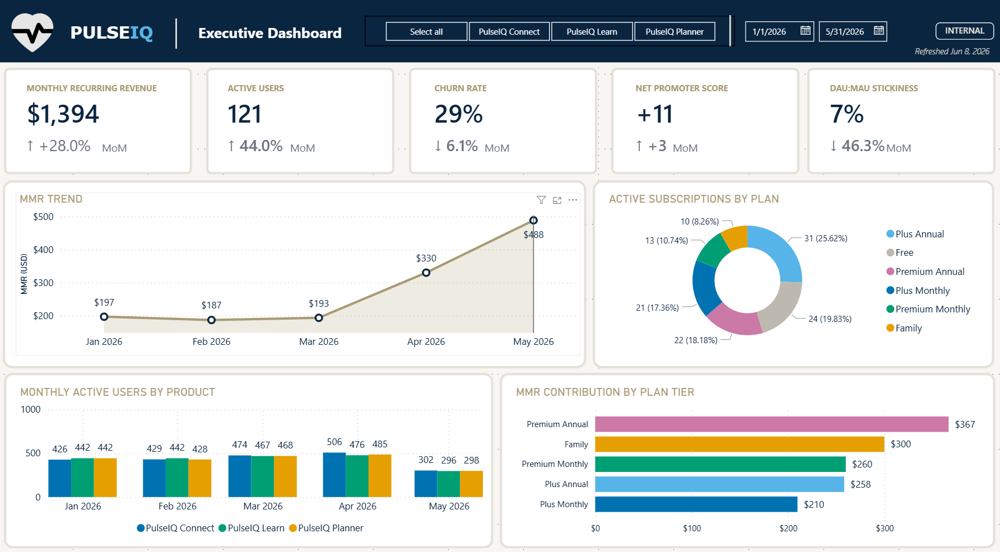
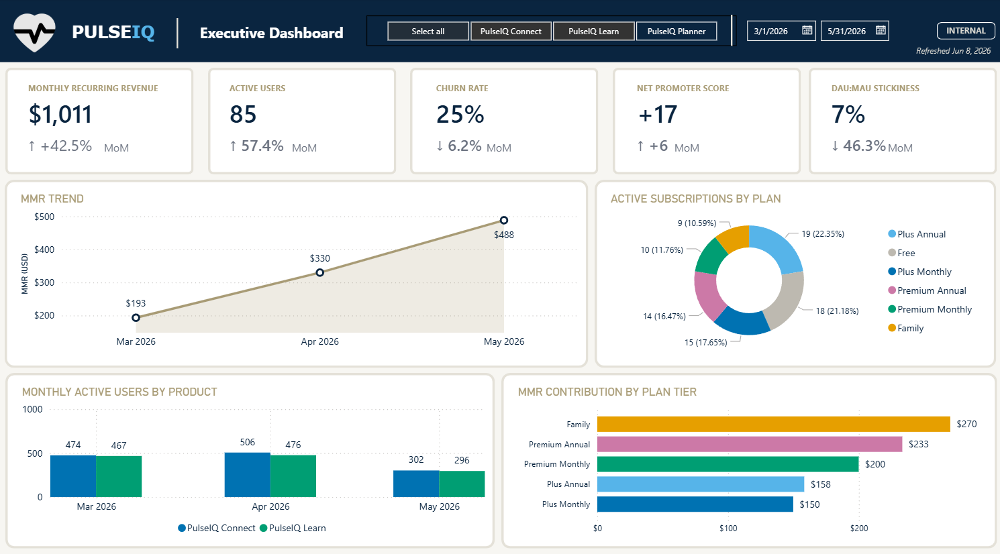

# PulseIQ SaaS Performance Analysis

## Overview
PulseIQ is a B2C software company that offers a suite of consumer productivity and lifestyle applications. Users can subscribe to one or multiple PulseIQ products and interact with features across web and mobile experiences.
The company tracks:
- Product engagement
- Feature adoption
- Customer retention
- Subscription revenue
- Customer satisfaction
- User sentiment

through behavioral analytics similar to Pendo, Amplitude, Mixpanel, and UserTesting.

## Business Question
> *"How healthy is PulseIQ’s product ecosystem, and where should we focus to improve engagement, retention, revenue growth, and overall user satisfaction across Planner, Connect, and Learn?"*

## Dashboard Objectives
1 · Product Engagement & Adoption
- How are users distributed across PulseIQ Planner, Connect, and Learn?
- Which products drive the highest daily and monthly active usage?
- What are the most and least adopted features across each product (Tasks, Calendar, Groups, Courses, etc.)?
- How frequently are users engaging with core features like tasks, messaging, and learning content?
- Which features show strong early adoption vs. drop-off after first use?
  
2 · Retention, Stickiness & User Behavior
- What is DAU, WAU, and MAU across each PulseIQ product?
- How sticky are users within and across products (DAU:MAU trends)?
- What does cohort retention look like for new users over time?
- Where do users drop off in their lifecycle across Planner, Connect, and Learn?
- Are multi-product users more retained than single-product users?
  
3 · Revenue, Subscription Health & Satisfaction
- What is monthly recurring revenue (MRR) and how is it trending month-over-month?
- How many users are on free vs. paid tiers across products?
- What is churn rate and how does it vary by product or user segment?
- What is the Net Promoter Score (NPS) and how is it trending over time?
- How do engagement and feature usage correlate with satisfaction and subscription upgrades?

## Data Model
Built on a database (12 tables).
See [data/data-dictionary.md](data/data-dictionary.md) for
column-level documentation.

Products
- PulseIQ Planner
- Personal productivity and goal tracking.
- Features
- Tasks
- Calendar
- Reminders
- Goal Tracking
- Habit Tracking

PulseIQ Connect
- Community and social engagement.
- Features
- Groups
- Messaging
- Reactions
- Events
- Discussions

PulseIQ Learn
- Learning and skill development.
- Features
- Courses
- Quizzes
- Certificates
- Learning Paths
- Progress Tracking

## SQL
Exploratory queries used to validate and shape the analysis
are in [/sql](/sql). Each file is self-documented with a
comment block explaining the business question it addresses.

## Tools Used
- **Power BI Desktop** — data model, DAX measures, report design
- **SQL** — data exploration and validation
- **DAX** — custom measures for revenue, ranking, and time intelligence

## How to Use This File
1. Download `report/PulseIQ_Analytics.pbix`
2. Open in Power BI Desktop (free download from Microsoft)
3. The embedded dataset loads automatically

## About
Built as part of my ongoing journey with data storytelling.
[LinkedIn](https://www.linkedin.com/in/emilypchee/) |
[Portfolio](https://seemly-existence-5eb.notion.site/You-got-questions-Emily-Chee-got-answers-02d623d6b64c496e818930e9b725b52c)
